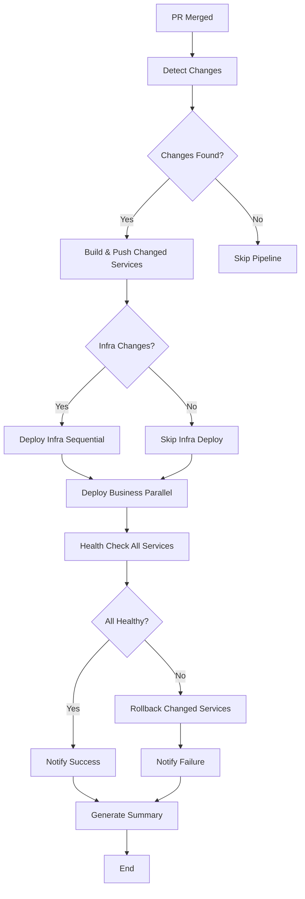

# Backend CI/CD Pipeline

## 🎯 Overview

This CI/CD pipeline uses a **trigger-and-dispatch** pattern to deploy backend microservices from feature branches to the dev environment.

---

## 🏗️ Architecture

```
Backend Repository (PR Merged)
    │
    └─► [Trigger Action]
           │ Sends repository_dispatch event
           │
           ▼
DevOps Repository
    │
    ├─► workflow-dispatcher.yml (Central Router)
    │      │
    │      └─► Dispatches to appropriate workflow
    │             │
    │             ▼
    └─► backend-feature-to-dev-cicd.yml (Reusable Workflow)
           │
           ├─► Job 1: Build & Push (12 services in parallel)
           │      ├─ Build Docker images
           │      ├─ Tag with commit SHA + latest
           │      └─ Push to ECR
           │
           ├─► Job 2: Deploy to ECS (Priority-based deployment)
           │      ├─ Config Server (Priority 1)
           │      ├─ Discovery Server (Priority 2)
           │      ├─ API Gateway (Priority 3)
           │      └─ Business Services (Priority 4, parallel)
           │
           ├─► Job 3: Health Check
           │      ├─ Verify all 12 services running
           │      ├─ Check task counts (running vs desired)
           │      └─ Get ALB endpoint
           │
           ├─► Job 4: Notify Slack
           │      ├─ Determine overall status
           │      └─ Send detailed notification
           │
           └─► Job 5: Summary
                  └─ Generate GitHub Actions summary
```

---

## 📦 What Was Implemented (Sprint 1)

### ✅ **1. ECS Deployment** (`deploy-to-ecs` job)

**Features:**

- ✅ Priority-based deployment (infrastructure services first)
- ✅ Parallel deployment for business services (max 4 at a time)
- ✅ Automatic task definition updates with new image tags
- ✅ Force new deployment to ensure latest images
- ✅ Wait for service stability before proceeding

**How it works:**

```yaml
1. Get current task definition from ECS
2. Update container image to new SHA tag
3. Register new task definition
4. Update ECS service with new task definition
5. Wait for service to stabilize (health checks pass)
```

**Priority levels:**

- **Priority 1:** Config Server (must be first)
- **Priority 2:** Discovery Server (depends on Config)
- **Priority 3:** API Gateway (depends on Discovery)
- **Priority 4:** All business services (can deploy in parallel)

### ✅ **2. Health Checks** (`health-check` job)

**Features:**

- ✅ Verifies all 12 services are running
- ✅ Compares running vs desired task counts
- ✅ Fails deployment if any service is unhealthy
- ✅ Retrieves ALB endpoint for testing

**Services checked:**

```
1. config-server
2. discovery-server
3. api-gateway
4. bff-service
5. user-service
6. task-service
7. analytics-service
8. payment-service
9. gamification-service
10. practice-service
11. feedback-service
12. notification-service
```

<!-- ### ✅ **3. Slack Notifications** (`notify-slack` job)

**Features:**

- ✅ Rich formatted notifications
- ✅ Color-coded status (green/red/yellow)
- ✅ Detailed job results
- ✅ PR information and author
- ✅ Links to GitHub PR -->

**Status determination:**

- **Success (green):** All jobs passed including health checks
- **Failed (red):** Build or push failed
- **Partial (yellow):** Build succeeded but deployment/health check failed

### ✅ **4. Enhanced Summary** (`summary` job)

**Features:**

- ✅ Comprehensive GitHub Actions summary
- ✅ Job status table
- ✅ Service list with ports
- ✅ ECR registry info
- ✅ Success/failure message

---

## 🔧 Configuration

### ⚠️ **Important: Repository Setup**

This workflow is designed to:

1. **Run in:** DevOps repository (`skill-tracker-devops`)
2. **Build from:** Backend repository (contains microservices code)

**The workflow checks out the backend repository** using the `repo_name` input parameter.

---

### Manual override: Force full build/deploy

You can manually force a full rebuild and redeploy of all services regardless of changes detected.

- **Input on reusable workflow:** `force_full_build: boolean` (default: `false`)
- **Behavior when true:**
  - Builds all images (infra + business)
  - Deploys infra (ordered) and all business services
  - Health check and notifications still run
    AWS_ACCESS_KEY_ID=<your-access-key>
    AWS_SECRET_ACCESS_KEY=<your-secret-key>
    AWS_REGION=eu-west-1

# ECR

ECR_REPOSITORY=962496666337.dkr.ecr.eu-west-1.amazonaws.com

# ECS

ECS_CLUSTER=sdt-dev-cluster
ECS_SERVICE=sdt-dev-\* # Pattern for service names

# Notifications

SLACK_WEBHOOK_URL=<your-slack-webhook>

# GitHub Access

PERSONAL_ACCESS_TOKEN=<github-pat-with-repo-access>
TARGET_REPO=<backend-repo-name>

````

### **Environment Variables** (in workflow)

```yaml
AWS_REGION: eu-west-1
ECR_REGISTRY: 962496666337.dkr.ecr.eu-west-1.amazonaws.com
ECR_REPOSITORY_PREFIX: sdt/dev
````

---

## 📊 Workflow Execution Flow

### **Timeline (Estimated)**

```
┌─────────────────────────────────────────────────────────┐
│ Total Time: ~15-20 minutes for full deployment          │
└─────────────────────────────────────────────────────────┘

1. Build & Push (12 services in parallel)         ~5-8 min
   └─ Maven build + Docker build + ECR push

2. Deploy to ECS (Priority-based)                 ~8-10 min
   ├─ Config Server                               ~2 min
   ├─ Discovery Server                            ~2 min
   ├─ API Gateway                                 ~2 min
   └─ Business Services (4 parallel batches)      ~2-4 min

3. Health Check                                   ~30 sec
   └─ Verify all services healthy

4. Slack Notification                             ~5 sec
   └─ Send notification

5. Summary                                        ~5 sec
   └─ Generate GitHub summary
```

### **Parallel Execution**

```
Build & Push (Matrix):
├─ config-server        ┐
├─ discovery-server     │
├─ api-gateway          │
├─ bff-service          │
├─ user-service         ├─ All 12 in parallel
├─ task-service         │
├─ analytics-service    │
├─ payment-service      │
├─ gamification-service │
├─ practice-service     │
├─ feedback-service     │
└─ notification-service ┘

Deploy (Priority-based):
1. config-server              ← Sequential
2. discovery-server           ← Sequential
3. api-gateway                ← Sequential
4. ├─ bff-service      ┐
   ├─ user-service     │
   ├─ task-service     ├─ Batch 1 (4 parallel)
   └─ analytics-service┘
5. ├─ payment-service      ┐
   ├─ gamification-service │
   ├─ practice-service     ├─ Batch 2 (4 parallel)
   └─ feedback-service     ┘
6. └─ notification-service ← Last batch
```

---

## 🔍 Monitoring & Debugging

### **GitHub Actions UI**

1. Go to DevOps repository
2. Click **Actions** tab
3. Select **Workflow Dispatcher** workflow
4. Click on the run to see:
   - Build progress for each service
   - Deployment status
   - Health check results
   - Summary with all details

### **CloudWatch Logs**

Monitor service deployments:

```bash
# Config Server
aws logs tail /ecs/sdt/dev/config-server --follow

# Discovery Server
aws logs tail /ecs/sdt/dev/discovery-server --follow

# Any service
aws logs tail /ecs/sdt/dev/SERVICE_NAME --follow
```

### **ECS Service Status**

```bash
# List all services
aws ecs list-services --cluster sdt-dev-cluster

# Check specific service
aws ecs describe-services \
  --cluster sdt-dev-cluster \
  --services sdt-dev-user-service

# View task status
aws ecs list-tasks \
  --cluster sdt-dev-cluster \
  --service-name sdt-dev-user-service
```

### **ECR Images**

```bash
# List images for a service
aws ecr describe-images \
  --repository-name sdt/dev/user-service \
  --query 'sort_by(imageDetails,& imagePushedAt)[-5:]'

# Get latest image
aws ecr describe-images \
  --repository-name sdt/dev/user-service \
  --query 'imageDetails[0].imageTags[0]'
```

---

## ⚠️ Troubleshooting

### **Issue: Build fails for a service**

**Symptoms:** Maven build or Docker build fails  
**Solution:**

1. Check CloudWatch logs for the failing service
2. Verify Dockerfile path is correct
3. Ensure dependencies are available
4. Check Java version (should be 21)

```bash
# Test build locally
docker build -f ./skilltracker-services/user-service/Dockerfile .
```

### **Issue: Deployment times out**

**Symptoms:** `aws ecs wait services-stable` times out  
**Solution:**

1. Check ECS service events:
   ```bash
   aws ecs describe-services \
     --cluster sdt-dev-cluster \
     --services sdt-dev-SERVICE_NAME \
     --query 'services[0].events[0:5]'
   ```
2. Verify task definition is valid
3. Check if container can start (memory/CPU limits)
4. Review service logs in CloudWatch

### **Issue: Health check fails**

**Symptoms:** Running count doesn't match desired count  
**Solution:**

1. Check if tasks are stopping due to errors:
   ```bash
   aws ecs describe-tasks \
     --cluster sdt-dev-cluster \
     --tasks TASK_ARN
   ```
2. Verify environment variables are set
3. Check database connectivity (RDS, MongoDB, Redis)
4. Ensure ALB target group health checks pass

### **Issue: Service can't reach dependencies**

**Symptoms:** Services fail to connect to DB, Redis, or other services  
**Solution:**

1. Verify security groups allow traffic
2. Check service discovery is working:
   ```bash
   aws servicediscovery list-services
   ```
3. Ensure secrets are accessible
4. Verify VPC networking

### Flow


