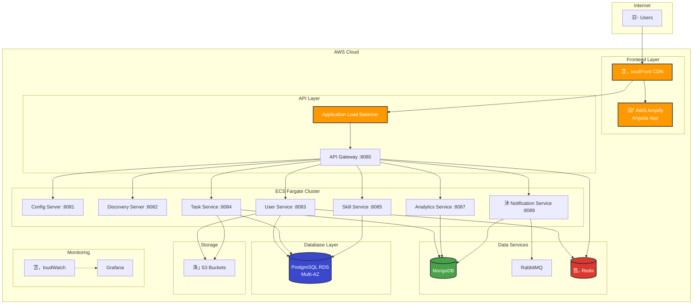
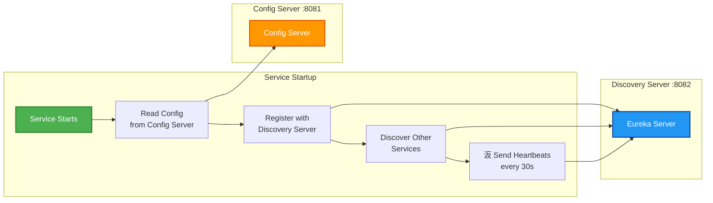
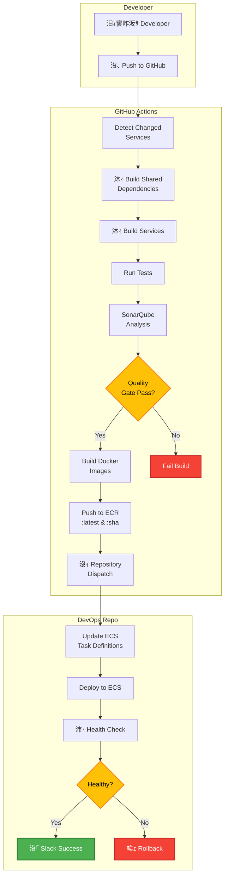
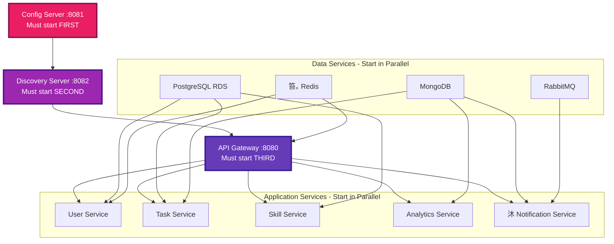

# Skill Tracker - Architecture Diagrams

Visual representations of the Skill Tracker architecture using both professional generated diagrams and Mermaid (inline) diagrams.

## Professional Diagrams (Generated with AWS Icons)

We have generated professional architecture diagrams with official AWS icons using Python's `diagrams` library.

### Generated Diagram Files

| Diagram | File | Description |
|---------|------|-------------|
| **Architecture Overview** | [architecture_overview.png](../diagrams/architecture_overview.png) | Complete system with all 12 microservices |
| **Network Architecture** | [network_architecture.png](../diagrams/network_architecture.png) | VPC topology and network flow |
| **CI/CD Pipeline** | [cicd_pipeline.png](../diagrams/cicd_pipeline.png) | Complete deployment workflow |
| **Monitoring Stack** | [monitoring_stack.png](../diagrams/monitoring_stack.png) | Observability architecture |
| **Data Flow** | [data_flow.png](../diagrams/data_flow.png) | Task submission data flow |

### Viewing the Diagrams

**In GitHub**: Click the links above to view the diagrams

**Locally**: Open the PNG files in `diagrams/` folder

**Regenerate**: See [diagrams/README.md](../diagrams/README.md) for instructions

---

## Interactive Diagrams (Mermaid)

> **Note**: Mermaid diagrams render directly in GitHub, GitLab, and most modern markdown viewers.

## System Overview



## Request Flow - Frontend to Backend


## OAuth Authentication Flow


## Service Discovery Flow



## CI/CD Pipeline Flow



## Data Flow - Task Submission


## Monitoring & Observability Flow

```mermaid
graph TB
    subgraph "Application Services"
        Services[12 Microservices]
    end
    
    subgraph "Logs"
        Services -->|Logs| CWLogs[笘，loudWatch Logs]
        CWLogs -->|Export| Lambda[⚡ Lambda Exporter]
        Lambda -->|Archive| S3Logs[🪣 S3 Logs Bucket]
    end
    
    subgraph "Metrics"
        Services -->|Metrics| CWMetrics[CloudWatch Metrics]
        CWMetrics -->|Query| Grafana[Grafana]
    end
    
    subgraph "Traces"
        Services -->|Traces| XRay[AWS X-Ray]
    end
    
    subgraph "Alarms"
        CWMetrics -->|Threshold| Alarms[CloudWatch Alarms]
        Alarms -->|Notify| SNS[📧 SNS Topic]
        SNS -->|Email| Email[📧 Email]
        SNS -->|Webhook| Slack[💬 Slack]
    end
    
    subgraph "Cost Monitoring"
        CostAPI[Cost Explorer API] -->|Fetch| CostLambda[⚡ Cost Exporter]
        CostLambda -->|Publish| CWMetrics
    end
    
    style Grafana fill:#F46800,stroke:#000,stroke-width:2px,color:#fff
    style Alarms fill:#F44336,stroke:#C62828,stroke-width:2px,color:#fff
    style Slack fill:#4A154B,stroke:#000,stroke-width:2px,color:#fff
```

## Network Architecture

```mermaid
graph TB
    subgraph "Internet"
        Internet[Internet]
    end
    
    subgraph "VPC 10.x.0.0/16"
        subgraph "Public Subnet 1 - AZ-1a"
            ALB1[ALB]
            NAT1[NAT Gateway]
        end
        
        subgraph "Public Subnet 2 - AZ-1b"
            ALB2[ALB]
            NAT2[NAT Gateway]
        end
        
        subgraph "Private Subnet 1 - AZ-1a"
            ECS1[ECS Tasks]
            RDS1[RDS Primary]
        end
        
        subgraph "Private Subnet 2 - AZ-1b"
            ECS2[ECS Tasks]
            RDS2[RDS Standby]
        end
        
        IGW[Internet Gateway]
    end
    
    Internet --> IGW
    IGW --> ALB1
    IGW --> ALB2
    ALB1 --> ECS1
    ALB2 --> ECS2
    ECS1 --> NAT1
    ECS2 --> NAT2
    NAT1 --> IGW
    NAT2 --> IGW
    ECS1 --> RDS1
    ECS2 --> RDS1
    RDS1 -.Replication.-> RDS2
    
    style IGW fill:#FF9900,stroke:#232F3E,stroke-width:2px,color:#fff
    style NAT1 fill:#FF9900,stroke:#232F3E,stroke-width:2px,color:#fff
    style NAT2 fill:#FF9900,stroke:#232F3E,stroke-width:2px,color:#fff
```

## Auto-Scaling Behavior


## Deployment Environments


## Service Dependencies



---

## Generated Diagrams

For high-resolution AWS architecture diagrams with official AWS icons, see the Python-generated diagrams in the `diagrams/` folder:

- `architecture_overview.png` - Complete system architecture
- `network_architecture.png` - VPC and networking details
- `cicd_pipeline.png` - CI/CD workflow
- `data_flow.png` - Data flow patterns
- `monitoring_stack.png` - Observability architecture

To regenerate diagrams, run:

```bash
cd diagrams
python generate_all_diagrams.py
```

## Diagram Tools Used

### Mermaid (Inline Diagrams)
- **Pros**: Renders in GitHub, version controlled, easy to update
- **Cons**: Limited styling, no official AWS icons
- **Best for**: Flows, sequences, state diagrams

### Python Diagrams (Generated Images)
- **Pros**: Professional AWS icons, high quality, automated
- **Cons**: Requires Python, generates binary files
- **Best for**: Architecture diagrams, presentations

### ASCII Diagrams (Fallback)
- **Pros**: Works everywhere, no dependencies
- **Cons**: Limited visual appeal
- **Best for**: Quick reference, documentation

## Viewing Mermaid Diagrams

Mermaid diagrams render automatically in:
- GitHub
- GitLab
- VS Code (with Markdown Preview Mermaid Support extension)
- IntelliJ IDEA (with Mermaid plugin)
- Obsidian
- Notion

If diagrams don't render, view them at: https://mermaid.live/

---

**Last Updated**: November 28, 2025
**Maintained By**: DevOps Team
