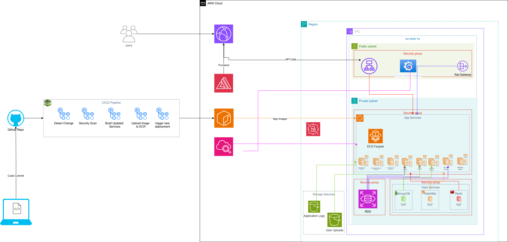

# Skill Tracker - DevOps Repository

Complete infrastructure and DevOps automation for the Skill Tracker platform - a microservices-based application with 8 active services deployed on AWS ECS Fargate.



## Documentation

**Start Here**: [Documentation Index](Docs/DocumentationIndex.md)

### Quick Links

| Document                                          | Purpose                           | 
| ------------------------------------------------- | --------------------------------- |
| [Documentation Index](Docs/DocumentationIndex.md) | Complete documentation guide      |
| [Frontend Guide](Docs/FrontendDocs.md)            | Angular app, Amplify, CloudFront  |
| [Backend Guide](Docs/BackendDocs.md)              | 8 microservices architecture      |
| [DevOps Guide](Docs/DevOpsDocs.md)                | CI/CD, monitoring, deployment     |
| [Diagrams](Docs/DiagramsDocs.md)                  | Visual architecture diagrams      |
| [Quick Reference](Docs/QuickReferenceDocs.md)     | Essential commands and operations |
| [Changelog](Docs/ChangelogDocs.md)                | Version history and updates       |
| [Architecture](infrastructure/ARCHITECTURE.md)    | System design and decisions       |
| [Infrastructure README](infrastructure/README.md) | Terraform setup and usage         |

## Quick Start

```bash
# Clone repository
git clone <repository-url>
cd skill-tracker-devops

# Setup infrastructure
cd infrastructure/envs/dev
terraform init
terraform plan
terraform apply
```

For detailed setup instructions, see [Infrastructure README](infrastructure/README.md) or [Quick Start Guide](infrastructure/QUICK_START.md).

## Architecture Overview

- **Frontend**: Angular app on AWS Amplify with CloudFront CDN
- **Backend**: 8 Spring Boot microservices on ECS Fargate
  - Core: Config Server, Discovery Server, API Gateway
  - Business: User, Task, Analytics, Feedback, Notification services
- **Data Services**: MongoDB, RabbitMQ, Redis (ECS containers)
- **Database**: PostgreSQL (RDS Multi-AZ)
- **Infrastructure**: Terraform-managed AWS resources
- **CI/CD**: GitHub Actions with SonarQube integration
- **Monitoring**: Grafana + CloudWatch + AWS X-Ray

## What's Included

- Complete Terraform infrastructure for dev/staging/production
- CI/CD pipelines for 8 active microservices
- Automated code quality analysis (SonarQube)
- Comprehensive monitoring (Grafana dashboards + CloudWatch)
- Real-time cost tracking and optimization
- Data services (MongoDB, RabbitMQ, Redis) on ECS
- Multi-AZ deployment with auto-scaling
- Security best practices (Secrets Manager, private subnets, IAM roles)

## Sprint 3 Achievements

- Expanded CI/CD pipeline to support 8 active microservices
- Integrated SonarQube for automated code quality analysis
- Implemented intelligent change detection (60% cost reduction)
- Deployed CloudFront CDN for frontend delivery
- Complete Grafana observability stack with custom dashboards
- Real-time cost monitoring with Lambda exporters
- Deployed data services (MongoDB, RabbitMQ, Redis) on ECS
- Fixed RabbitMQ Erlang cookie permissions
- Updated OAuth redirect URLs for CloudFront

See [DevOps Guide](Docs/DevOpsDocs.md#sprint-3-achievements) for complete details.

## Related Repositories

- **Backend**: AmaliTech-Training-Academy/skill-tracker-backend
- **Frontend**: AmaliTech-Training-Academy/skill-tracker-frontend
- **DevOps**: AmaliTech-Training-Academy/skill-tracker-devops (this repo)

## Learn More

Visit the [Documentation Index](Docs/DocumentationIndex.md) for comprehensive guides organized by role and task.
