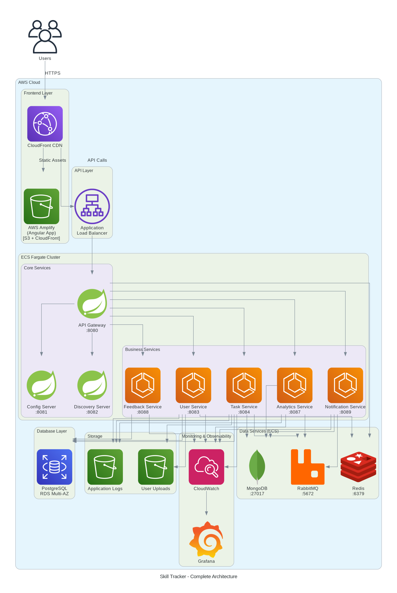

# Skill Tracker - Architecture Diagrams

Professional architecture diagrams generated using Python's `diagrams` library with official AWS icons.

## Available Diagrams

1. **architecture_overview.png** - Complete system architecture
2. **network_architecture.png** - VPC and network topology
3. **cicd_pipeline.png** - CI/CD workflow
4. **monitoring_stack.png** - Monitoring and observability
5. **data_flow.png** - Data flow for task submission

## Quick Start

### Prerequisites

1. **Python 3.7+**
   ```bash
   python3 --version
   ```

2. **Graphviz** (required for rendering)
   
   **Arch Linux:**
   ```bash
   sudo pacman -S graphviz
   ```
   
   **macOS:**
   ```bash
   brew install graphviz
   ```
   
   **Ubuntu/Debian:**
   ```bash
   sudo apt-get install graphviz
   ```
   
   **Windows:**
   ```bash
   choco install graphviz
   ```
   Or download from: https://graphviz.org/download/

### Installation

```bash
# Install Python dependencies
pip install -r requirements.txt

# Or install directly
pip install diagrams
```

### Generate All Diagrams

```bash
# Make script executable
chmod +x generate_all_diagrams.py

# Run generator
python3 generate_all_diagrams.py
```

### Generate Individual Diagrams

```bash
# Architecture overview
python3 generate_architecture.py

# Network architecture
python3 generate_network.py

# CI/CD pipeline
python3 generate_cicd.py

# Monitoring stack
python3 generate_monitoring.py

# Data flow
python3 generate_data_flow.py
```

## Generated Files

After running the scripts, you'll have:

```
diagrams/
├── architecture_overview.png
├── network_architecture.png
├── cicd_pipeline.png
├── monitoring_stack.png
└── data_flow.png
```

## Diagram Details

### 1. Architecture Overview
**File:** `architecture_overview.png`
**Script:** `generate_architecture.py`

Shows the complete system architecture including:
- Frontend layer (CloudFront, Amplify)
- API layer (ALB, API Gateway)
- 12 microservices on ECS Fargate
- Data services (MongoDB, RabbitMQ, Redis)
- Database layer (RDS PostgreSQL)
- Storage (S3)
- Monitoring (CloudWatch, Grafana)

### 2. Network Architecture
**File:** `network_architecture.png`
**Script:** `generate_network.py`

Shows the network topology:
- VPC with multi-AZ deployment
- Public and private subnets
- Internet Gateway and NAT Gateways
- Load balancers
- ECS tasks in private subnets
- RDS Multi-AZ configuration

### 3. CI/CD Pipeline
**File:** `cicd_pipeline.png`
**Script:** `generate_cicd.py`

Shows the deployment workflow:
- GitHub source control
- GitHub Actions CI/CD
- Build and test stages
- SonarQube quality gates
- Docker image building
- ECR registry
- ECS deployment
- Health checks
- Slack notifications

### 4. Monitoring Stack
**File:** `monitoring_stack.png`
**Script:** `generate_monitoring.py`

Shows observability architecture:
- Application services
- CloudWatch logs and metrics
- Log archiving to S3
- Grafana dashboards
- Cost monitoring
- Alerting via SNS and Slack
- AWS X-Ray tracing

### 5. Data Flow
**File:** `data_flow.png`
**Script:** `generate_data_flow.py`

Shows data flow for task submission:
- User request through API Gateway
- Task Service processing
- Parallel writes to PostgreSQL and MongoDB
- Event publishing to RabbitMQ
- Event consumption by multiple services
- Response flow back to user

## Icon Limitations

The Python `diagrams` library doesn't have dedicated icons for all AWS services. We use appropriate alternatives:

- **AWS Amplify**: Using S3 icon (Amplify uses S3 + CloudFront under the hood)
- **AWS X-Ray**: Using Jaeger icon (both are distributed tracing systems)

These are functional equivalents and accurately represent the architecture.

## Customization

### Modify Diagrams

Edit the Python scripts to customize:

```python
# Change diagram direction
direction="TB"  # Top to Bottom
direction="LR"  # Left to Right

# Change output format
filename="my_diagram"  # Generates my_diagram.png

# Add custom styling
graph_attr = {
    "fontsize": "14",
    "bgcolor": "white",
    "pad": "0.5",
}
```

### Add New Diagrams

1. Create a new Python script (e.g., `generate_security.py`)
2. Import required components from `diagrams` library
3. Define your diagram structure
4. Add to `DIAGRAM_SCRIPTS` list in `generate_all_diagrams.py`

Example:

```python
from diagrams import Diagram, Cluster
from diagrams.aws.security import IAM, SecretsManager

with Diagram("Security Architecture", filename="security", show=False):
    iam = IAM("IAM Roles")
    secrets = SecretsManager("Secrets Manager")
    
    iam >> secrets
```

## Documentation Integration

### In Markdown Files

Reference generated diagrams in your documentation:

```markdown
## Architecture Overview



The system consists of...
```

### In DiagramsDocs.md

The main diagrams documentation file includes:
- ASCII diagrams for quick reference (renders in GitHub)
- References to generated PNG diagrams
- Detailed explanations of each component

## 🐛 Troubleshooting

### Issue: "graphviz not found"

**Solution:**
```bash
# macOS
brew install graphviz

# Ubuntu/Debian
sudo apt-get install graphviz

# Verify installation
dot -V
```

### Issue: "ModuleNotFoundError: No module named 'diagrams'"

**Solution:**
```bash
pip install diagrams
# or
pip install -r requirements.txt
```

### Issue: "Permission denied"

**Solution:**
```bash
chmod +x generate_all_diagrams.py
chmod +x generate_*.py
```

### Issue: Diagrams look different than expected

**Solution:**
- Ensure graphviz is installed and in PATH
- Try regenerating: `python3 generate_all_diagrams.py`
- Check Python version: `python3 --version` (requires 3.7+)

## Best Practices

1. **Version Control**: Commit both scripts and generated PNGs
2. **Regenerate**: Update diagrams when architecture changes
3. **Documentation**: Keep DiagramsDocs.md in sync with generated diagrams
4. **Naming**: Use descriptive filenames for generated diagrams
5. **Format**: PNG for documentation, SVG for presentations (change in script)

## Resources

- **Diagrams Library**: https://diagrams.mingrammer.com/
- **AWS Icons**: https://aws.amazon.com/architecture/icons/
- **Graphviz**: https://graphviz.org/
- **Examples**: https://diagrams.mingrammer.com/docs/getting-started/examples

## Updating Diagrams

When architecture changes:

1. Update the relevant Python script
2. Regenerate diagrams: `python3 generate_all_diagrams.py`
3. Commit changes to Git
4. Update documentation references if needed

## Tips

- Use `direction="TB"` for vertical layouts
- Use `direction="LR"` for horizontal layouts
- Group related components in `Cluster`
- Use `Edge(label="text")` for connection labels
- Use `Edge(color="red")` for error paths
- Use `Edge(style="dashed")` for optional connections

## Support

**Questions**: #devops-support Slack channel
**Issues**: Create GitHub issue
**Updates**: Submit pull request

---

**Last Updated**: November 28, 2025
**Maintained By**: DevOps Team
